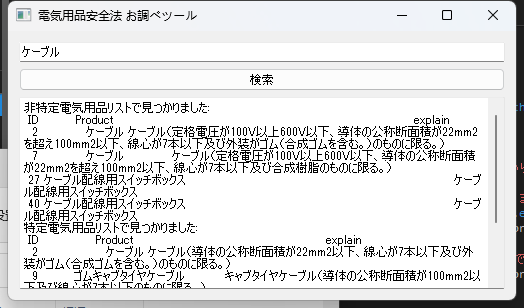

# PSE_checker
## Prototype Version

This tool is tailored for Japan's local regulations. Below is the English version of the README.


## Purpose

- Not all electrical devices can simply be connected to power without concern.
- Japan's regulations include penalty provisions for non-compliance, so please proceed cautiously.

---

## excel_splitte.py (New as of December 17th, 2024)

This script is used for splitting classification verification files as a preprocessing step.

### Usage

```bash
python excel_splitte.py

```

> [!TIP]
> For more details, please visit the METI (Ministry of Economy, Trade and Industry) website.
Reference Links
> https://www.goodgoods.co.jp/pse


> 
 
## Overview of PSE Mark and Certification
### METI Official Resources:
        - Main Page for Electrical Appliance and Material Safety Act
        - DENAN Act Outline
     https://www.meti.go.jp/policy/consumer/seian/denan/

     https://www.meti.go.jp/policy/consumer/seian/denan/act_outline.html


## Sample Screenshots



# Python Command Line Features

    Partial match search is supported.
    Highlights whether a product is categorized as a "Specified Electrical Appliance" or "Non-specified Electrical Appliance."
    If the item cannot be found in the search results, and neither the web nor experts can identify it, certification may not be required.

Example of the search window:

Search Window

To run the search tool:

```bash

python pse_check.py

```
# Dependencies

- The tool uses PySide2 for its GUI components. To install the required libraries, run the following commands:

```bash

pip install PySide2
pip install pandas
pip install pycopy-webbrowser

```
# License Notes
> [!NOTE]
> As PySide2 is licensed under LGPL, this tool inherits copyleft obligations. Please ensure compliance with LGPL terms if you distribute modified or derivative works.
Future Updates

> The current tool includes rough web searches for items that cannot be identified in the database. Future versions aim to improve accuracy and eliminate the need for these external searches.
About PSE_checker

> This tool assists in verifying compliance with Japan's Electrical Appliance and Material Safety Act (DENAN law).
> The excel_splitte.py script helps preprocess data by splitting classification verification files. Once processed, these files can be used to ensure proper certification and legal compliance.
> Additional Notes

# Focus of This Project

- This project focuses on compliance with Japan’s Electrical Appliance and Material Safety Act (DENAN law).
- The excel_splitte.py script is particularly useful for preprocessing data by splitting classification verification files. These processed files can then be used to ensure proper certification and legal compliance.
