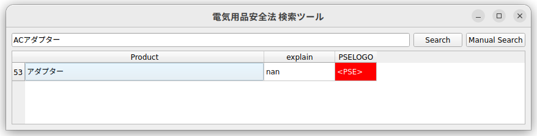

# PSE_checker
## Prototype version

# Japan Localなものなので、日本語で記載します。
- 何でもかんでも通電すればいいものではないです。
- 罰則規定もありますから注意しましょう。

# 参考リンク

https://www.goodgoods.co.jp/pse

## 経済産業省サイト
https://www.meti.go.jp/policy/consumer/seian/denan/

https://www.meti.go.jp/policy/consumer/seian/denan/act_outline.html


# サンプル画面


# python version command line
- python 版では部分一致検索可能です。また特定電気用品かそれ以外かを強調表示
- 検索にかからないもの、Webや詳しい人に聞いても出てこないものは申請の必要なし



```
python pse_check.py

```

## Pyside2 使用しています。

```

pip install PySide2
Pip install pandas
pip install pycopy-webbrowser

```
PySide2 使用の為、LGPLとなり、コピーレフトとなります。ご注意を。

特定電気用品（それ以外）の一覧でうまく部分一致しない場合Webでザックリ検索します。将来はザックリ検索なしにしたいです。


